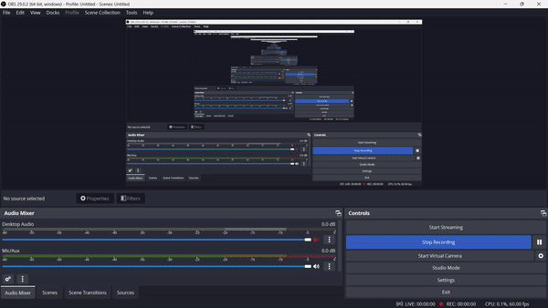

# Collage-Project
# Topic : Malware and spyware analysis using the implantation and prevention of novel keyloggers

all the details are here in this document: https://drive.google.com/drive/folders/1E7Im9l57fxRX628d4VAv55gPtQr6NTym?usp=drive_link (Because of collage project we need to use google drive for access the project document you need to contact with me.) 

#### Small demo about the project 

### ABSTRACT

The goal of this project is to detect the presence of keyloggers in the system and alert the user.
Keystroke logging is the action of recording (logging) the keys pressed on the keyboard,
usually hidden so that the person using the keyboard is unaware that his actions are being
monitored. increase. The data can be obtained by the operator of the logging program.
Keyloggers are either software or hardware.
Keyloggers are most commonly used to steal passwords and other sensitive information. Focus
on software-based keyloggers. The
software keylogger works by setting up a Windows hook that tells the keylogger which keys
are pressed, where the mouse is moved, and where the mouse is clicked, whenever the user
presses a key or uses the mouse. To do.
A software keylogger is created and implemented to simulate the attack, and a system to detect
the keylogger is also created.

### INTRODUCTION

Keystroke logging, often referred to as key-logging or keyboard capturing, is the action of
recording (logging) the keys struck on a keyboard, typically covertly, so that the person using
the keyboard is unaware that their actions are being monitored. Data can then be retrieved by
the person operating the logging program. A key-logger can be either software or hardware.
While the programs themselves are legal, with many of them being designed to allow
employers to oversee the use of their computers, key-loggers are most often used for the
purpose of stealing passwords and other confidential information.

Key-logging can also be used to study human–computer interaction. Numerous key-logging
methods exist: they range from hardware and software-based approaches to acoustic analysis.
These are computer programs designed to work on the target computer's software. Key-loggers
are used in IT organisations to troubleshoot technical problems with computers and business
networks. Families and business people use key-loggers legally to monitor network usage
without their users' direct knowledge. Even Microsoft publicly admitted that Windows 10
operation system has a built-in key-logger in its final version ―to improve typing and writing
services‖. However, malicious individuals can use key-loggers on public computers to steal
passwords or credit card information. Most key-loggers are not stopped by HTTPSencryption
because that only protects data in transit between computers, thus the threat being from the
user's computer.

